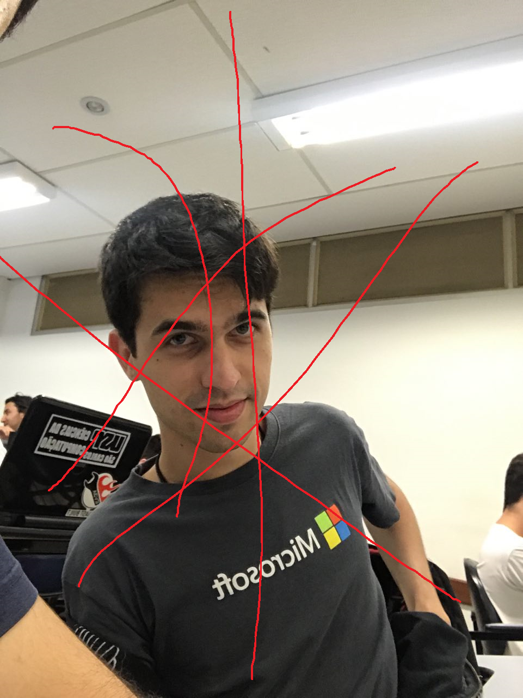
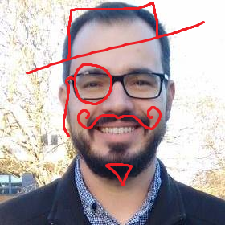
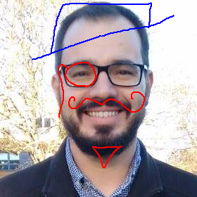
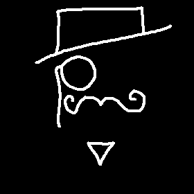

<h1 align="center">Inpainting</h1>

# Introdução
*Inpaiting* é o processo de reconstrução digital de partes perdidas ou deteriodadas de imagens ou vídeos.
Neste trabalho são estudadas duas técnicas de *inpaiting* para a remoção de rabiscos inseridos artificialmente em fotos.

# Algoritmos

# Imagens utilizadas
Para testar os algoritmos implementados, foram utilizadas as imagens mostradas abaixo.

# Extração da máscara

Foi implementada a extração automática das máscaras para *inpaiting* das imagens.

|||
|:-----------------------------------:|:-----------------------------------:|
| Foto deteriorada | Máscara extraída|

# Inpainting das imagens

||||
|------------|------------|------------|
| Foto deteriorada | Gerchberg Papoulis | Inpainting por exemplos|

# Analise dos resultados

# Próximos Passos

### Autores

|  |                |
|:-----------------------------------------------------------------------------------------------------------------:|:-------------------------------------------------------------------------------------------------------:|
|[Marcos Cesar Ribeiro de Camargo](https://github.com/marcoscrcamargo/)|[Victor Luiz Roquete Forbes](https://github.com/VictorXjoeY/)|
| 9278045 | 9293394|

