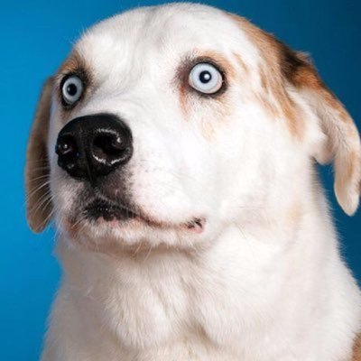
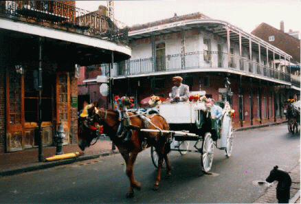
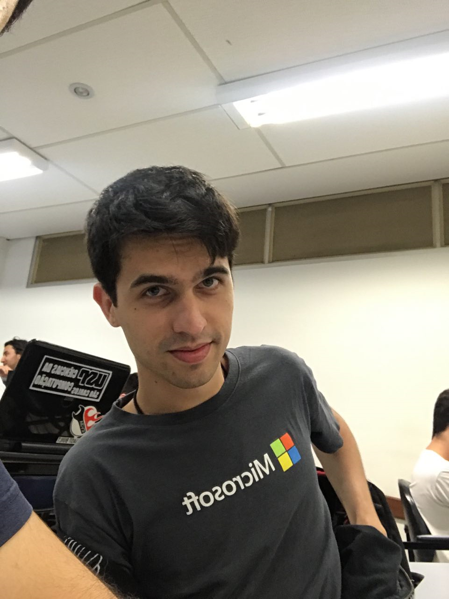
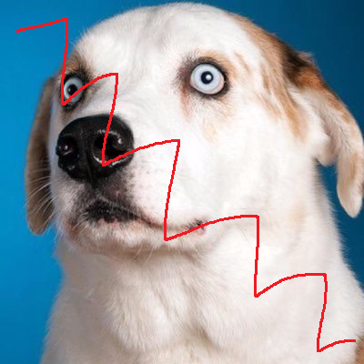
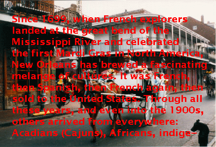
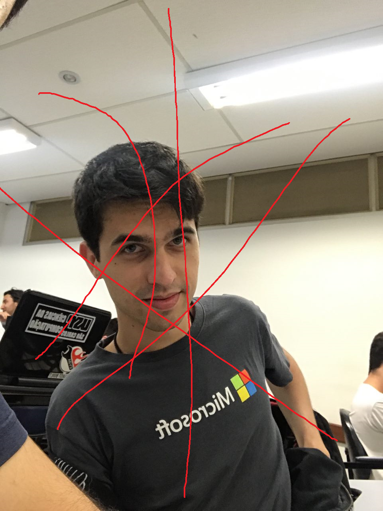
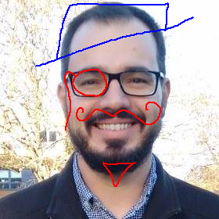
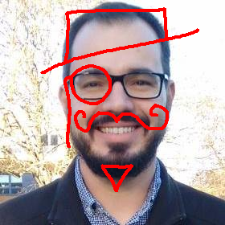
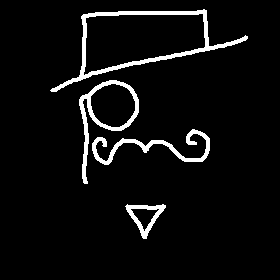
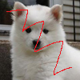

<h1 align="center">Inpainting</h1>

## Autores

|  |                |
|:-----------------------------------------------------------------------------------------------------------------:|:-------------------------------------------------------------------------------------------------------:|
|[Victor Luiz Roquete Forbes](https://github.com/VictorXjoeY/)|[Marcos Cesar Ribeiro de Camargo](https://github.com/marcoscrcamargo/)|
| 9293394 | 9278045|

# Introdução
*Inpainting* é o processo de reconstrução digital de partes perdidas ou deterioradas de imagens e vídeos, também conhecida como interpolação de imagens e vídeos. Refere-se à aplicação de algoritmos sofisticados para substituir partes perdidas ou corrompidas da imagem (principalmente pequenas regiões ou para remover pequenos defeitos).

Nessa etapa do trabalho estudamos e implementamos duas técnicas de *inpainting* para a remoção automática de rabiscos inseridos artificialmente em imagens. Para realizarmos a detecção automática da região que devemos fazer *inpainting* usamos do fato de que os rabiscos são feitos com cores contrastantes que ocorrem com alta frequência nas imagens.

# Conjunto de imagens
Parte do conjunto de imagens utilizado é apresentado abaixo. Essas quatro imagens servirão de exemplo para a execução dos algoritmos.

## Imagens Originais
As imagens abaixo estão em sua forma original.

|||||
|------------|------------|------------|------------|
| Cachorro (retirada da internet) | Texto em foto (retirada de um artigo) | Forbes | Professor Moacir |

## Imagens Deterioradas
As imagens abaixo foram rabiscadas artificialmente. A única imagem que não inserimos rabiscos foi a segunda imagem, que foi retirada de um artigo.

|||||
|------------|------------|------------|------------|
| Cachorro (retirada da internet) | Texto em foto (retirada de um artigo) | Forbes | Professor Moacir |

# Obtenção da máscara

O primeiro passo para realizar *inpainting* é definir a região deteriorada. Para isso implementamos dois métodos simples para extrair a máscara automaticamente. Para essa etapa do trabalho queremos realizar *inpainting* em cores específicas, ou seja, assumimos como sendo parte da região deteriorada todos os *pixels* que possuem certas cortes determinadas pelos métodos descritos a seguir.

O primeiro passo de ambos os métodos é calcular o número de ocorrências de cada tripla de cor RGB. Optamos por ignorar cores muito próximas do branco absoluto (255, 255, 255) pois alguns dos experimentos foram feitos com imagens com excesso de luz. Ignoramos então as cores que possuem valor maior ou igual a 250 nos três canais.

Vale notar que ambos os métodos podem ser melhorados para que a máscara obtida represente não só algumas cores pré-determinadas pelos métodos, mas que represente também a "penumbra" que muitas ferramentas de edição inserem nas bordas dos traços. Para isso basta extraírmos a máscara usando os métodos abaixo e depois preencher todos os *pixels* não preenchidos adjacentes a um ou mais *pixels* preenchidos que possuem o mesmo tom (canal H da representação de cor HSL).

|||
|:-----------------------------------:|:-----------------------------------:|
| Foto deteriorada | Máscara extraída |

## *Most Frequent*
Nesse método assumimos que apenas uma cor deve ser removida: a mais frequente. Esse método funciona muito bem quando existe rabiscos de apenas uma cor.

## *Minimum Frequency*

Nesse método definimos um *threshold* e assumimos que todas as cores que ocorrem mais vezes do que esse *threshold* fazem parte da região de *inpainting*. Para essa etapa definimos o *threshold* como sendo 1% dos *pixels* da imagem, ou seja, se alguma cor ocorrer em mais do que 1% da imagem, ela é considerada "rabisco". Esse método não funciona tão bem quando existe rabiscos de apenas uma cor, mas é um método necessário para remover rabiscos de diferentes cores.

# Algoritmos de *Inpainting*
## Gerchberg Papoulis
O algoritmo Gerchberg-Papoulis é um algoritmo de *inpaiting* por difusão que funciona por meio de cortes nas frequencias obtidas pela Transformada Discreta de Fourier (DFT), zerando parte das frequências das imagens.

Considerando uma Máscara **M** que possui valor 0 nos locais em que a imagem é conhecida e 255 nas regiões deterioradas, o algoritmo com **T** iterações é aplicado da seguinte maneira:

1. *g_0* = Imagem inicial
2. Obtenção da DFT de M.
3. Para cada iteração k = 1, ..., T
	+  *G_k* = DFT de *g_{k-1}*
	+  Filtra *G_k* zerando coeficientes das frequências relativos a:
		+  *G_k* >= 0.9 * max(*M*) 
		+  *G_k* <= 0.01 * max(*G_k*) 
	+  Convolução de *G_k* com um filtro de média *k x k*.
	+  *g_k* = IDFT de *G_k*
	+  Normalização de *G_k* entre 0 e 255.
	+  Inserção dos pixels de *gk* somente na região referente a máscara.
		+  *g_k* = (1 - M/255) * *g_0* + (M/255) * *g_k*

Ao final do processo é obtida a imagem *G_k* restaurada.

|||||
|------------|------------|------------|------------|
| Cachorro (retirada da internet) | Texto em foto (retirada de um artigo) | Forbes | Professor Moacir |

## *Inpainting* por exemplos
Os algoritmos de *Inpainting* por exemplos utilizados consistem em substituir cada *pixel* deteriorado *Pd* por um *pixel* não deteriorado *P* cuja janela *K*x*K* centrada em *P* maximiza uma certa medida de similaridade em relação a janela *K*x*K* centrada em *Pd*.

O *K* é definido automaticamente levando em consideração a "grossura" do rabisco da seguinte forma: Para cada *pixel* deteriorado *Pd* calcula-se sua distância de Manhattan para o pixel não-deteriorado mais próximo. Ao recuperar o máximo de todos esses valores, multiplica-lo por 2 e somar 3, obtemos um valor para *K* grande o suficiente para a região deteriorada nunca conter completamente uma janela *K*x*K*.

A medida de distância utilizada foi similar ao RMSE, mas calculado apenas entre *pixels* não-deteriorados. Vale dizer que para todo o projeto assumimos que os *pixels* fora da imagem são pretos (0, 0, 0).

### *Brute Force*
Nesse algoritmo a busca pelo *pixel* *P* é feita em toda a imagem. Esse algoritmo obtém os melhores resultados em geral, mas seu tempo de execução é altíssimo e, portanto, apenas conseguimos rodar para a imagem dogo1.bmp (100x100) e dogo2.bmp (400x400).

|||||
|------------|------------|------------|------------|
| Cachorro 100x100 deteriorado | Cachorro 100x100 reconstruído | Cachorro 400x400 deteriorado | Cachorro 400x400 reconstruído |

### *Local Brute Force*
Nesse algoritmo fazemos a suposição de que as janelas mais similares não estão muito longe da região deteriorada, portanto a busca pelo *pixel* *P* é feita apenas em uma região 101x101 centrada em *Pd*. Isso permite que façamos *inpainting* em imagens maiores em tempo hábil.

|||||
|------------|------------|------------|------------|
| Cachorro (retirada da internet) | Texto em foto (retirada de um artigo) | Forbes | Professor Moacir |

<!-- # Analise dos resultados -->

# Instruções para execução do código
A imagem de entrada deve estar na pasta project/images/deteriorated/, a máscara será salva em project/images/masks/ e a imagem de saída na pasta project/images/deteriorated/<inpaiting_algorithm>/.

A compilação do código em C++ foi feita utilizando o cmake com o arquivo CMakeLists.txt dentro da pasta Project, então para gerar o Makefile e compilar o executável é preciso executar os comandos: 

	cd project/
	mkdir build/
	cd build/
	cmake ../
	make

A execução do código em **C++** é feita pelo comando:

	./main <image_in.bmp> <image_out.bmp> <mask_extraction_algorithm> <inpainting_algorithm>

A execução do código em **Python** é feita pelo comando:

	python3 main.py <image_in.bmp> <image_out.bmp> <mask_extraction_algorithm>

O código em **Python** só contém a implementação do algoritmo *Gerchberg Papoulis*, por isso não é necessário escolher o algoritmo de *inpainting*.

Os argumentos dos programas são:
 * <image_in.bmp> - Imagem de entrada.
 * <image_out.bmp> - Imagem de saída.
 * <mask_extraction_algorithm> - Algoritmo de extração da máscara (*most_frequent* ou *minimum_frequency*).
 * <inpainting_algorithm> - Algoritmo de *inpainting* (*brute* ou *local*).

# Próximos Passos

Os próximos passos para o projeto incluem:

 * Melhorar a extração automática das máscaras.
 * Implementação de uma versão mais otimizada do algoritmo de *Inpainting* por exemplos (*Smart Brute Force*).
 * Experimentos com as diferentes possíveis medidas de distância entre janelas *K*x*K*.
 * Visualização da diferença entre as imagem originais e as imagens reconstruídas.
 * Análise do RMSE entre as imagens originais e as imagem reconstruídas.

