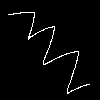
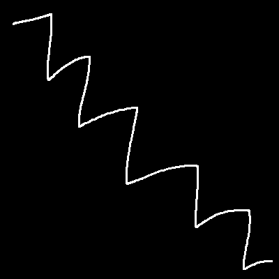

<h1 align="center">Inpainting</h1>

# Introdução
*Inpaiting* é o processo de reconstrução digital de partes perdidas ou deteriodadas de imagens ou vídeos.
Neste trabalho são estudadas duas técnicas de *inpaiting* para a remoção de rabiscos inseridos artificialmente em fotos.

# Imagens utilizadas

# Extração da máscara

# Inpainting das imagens

# Comparação com a imagem original

### Autores
<!-- |   Autores |
| --- | -->

|  |                |
|:-----------------------------------------------------------------------------------------------------------------:|:-------------------------------------------------------------------------------------------------------:|
|[Marcos Cesar Ribeiro de Camargo](https://github.com/marcoscrcamargo/)|[Victor Luiz Roquete Forbes](https://github.com/VictorXjoeY/)|
| 9278045 | 9293394|

