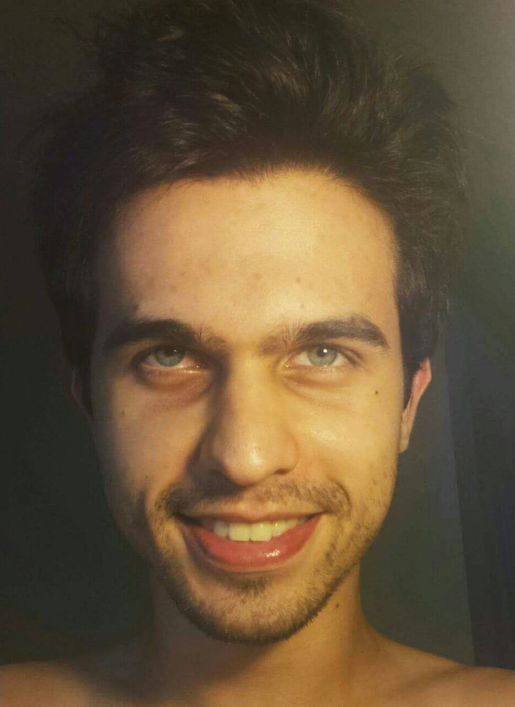
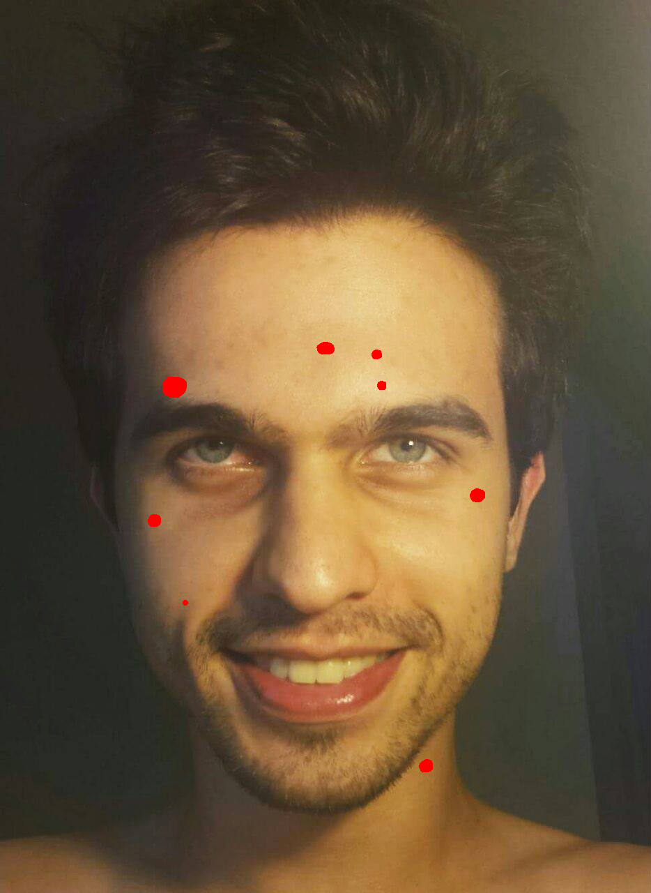
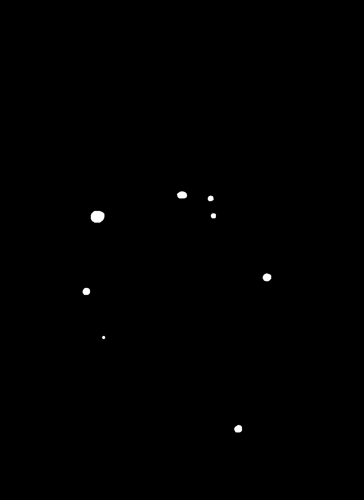
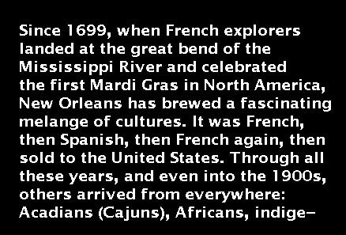
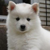
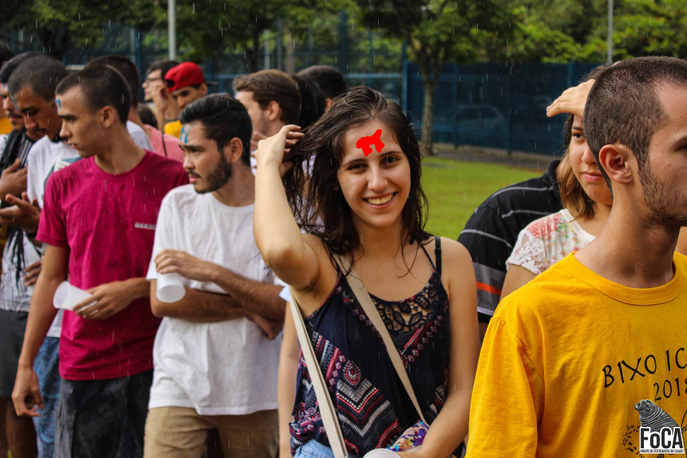
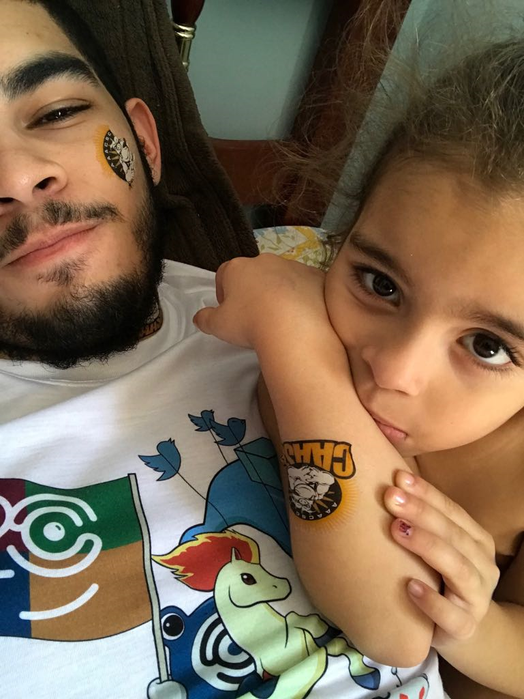
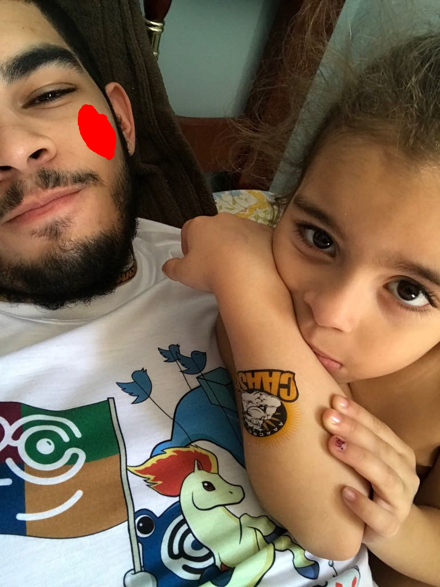
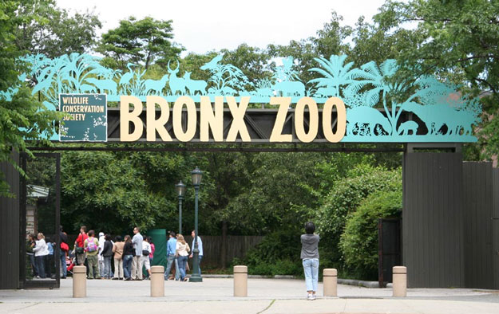
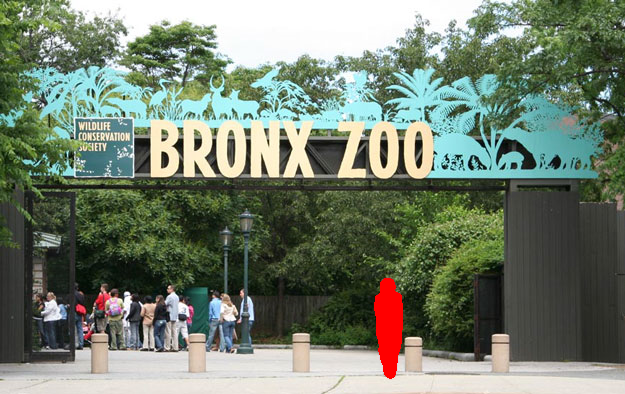

<h1 align="center">Inpainting</h1>

## Autores

|  |                |
|:-----------------------------------------------------------------------------------------------------------------:|:-------------------------------------------------------------------------------------------------------:|
|[Victor Luiz Roquete Forbes](https://github.com/VictorXjoeY/)|[Marcos Cesar Ribeiro de Camargo](https://github.com/marcoscrcamargo/)|
| 9293394 | 9278045|

# Introdução
*Inpainting* é o processo de reconstrução digital de partes perdidas ou deterioradas de imagens e vídeos, também conhecida como interpolação de imagens e vídeos. Refere-se à aplicação de algoritmos sofisticados para substituir partes perdidas ou corrompidas da imagem (principalmente pequenas regiões ou para remover pequenos defeitos).

Nesse projeto estudamos e implementamos técnicas de *inpainting* para a remoção automática de rabiscos inseridos artificialmente em imagens. Para realizarmos a detecção automática da região que devemos fazer *inpainting* usamos do fato de que os rabiscos são feitos com cores contrastantes que ocorrem com alta frequência nas imagens.

Aplicamos os métodos utilizados para a remoção de objetos em imagens também. Para isso é necessário desenhar em cima do objeto a ser removido com um pincel duro com uma cor contrastante como, por exemplo, o vermelho (255, 0, 0).

# Conjunto de imagens
Parte do conjunto de imagens utilizado é apresentado abaixo. Todas as imagens utilizadas estão no formato Bitmap (.bmp).

## Imagens Originais
As imagens abaixo estão em sua forma original.

|||||
|------------|------------|------------|------------|
| Cachorro ([retirada da internet](https://pbs.twimg.com/profile_images/948761950363664385/Fpr2Oz35_400x400.jpg)) | Texto em foto (retirada de um [artigo](http://www.inf.ufrgs.br/~oliveira/pubs_files/inpainting.pdf)) | Forbes | Professor Moacir |

## Imagens Deterioradas
As imagens abaixo foram rabiscadas artificialmente. A única imagem que não inserimos rabiscos foi a segunda imagem, que foi retirada de um [artigo](http://www.inf.ufrgs.br/~oliveira/pubs_files/inpainting.pdf).

|||||
|------------|------------|------------|------------|
| Cachorro ([retirada da internet](https://pbs.twimg.com/profile_images/948761950363664385/Fpr2Oz35_400x400.jpg)) | Texto em foto (retirada de um [artigo](http://www.inf.ufrgs.br/~oliveira/pubs_files/inpainting.pdf)) | Forbes | Professor Moacir |

# Algoritmos de extração da máscara

O primeiro passo para realizar *inpainting* é definir a região deteriorada. Para isso implementamos dois métodos simples para extrair a máscara automaticamente. Para essa etapa do trabalho queremos realizar *inpainting* em cores específicas, ou seja, assumimos como sendo parte da região deteriorada todos os *pixels* que possuem certas cortes determinadas pelos métodos descritos a seguir.

O primeiro passo de ambos os métodos é calcular o número de ocorrências de cada tripla de cor RGB. Optamos por ignorar cores muito próximas do branco absoluto (255, 255, 255) pois alguns dos experimentos foram feitos com imagens com excesso de luz. Ignoramos então as cores que possuem valor maior ou igual a 250 nos três canais.

Vale notar que os métodos podem ser melhorados para que a máscara obtida represente não só algumas cores pré-determinadas pelos métodos, mas que represente também a "penumbra" que muitas ferramentas de edição inserem nas bordas dos traços. Para isso podemos extrair a máscara usando os métodos abaixo e depois preencher todos os *pixels* não preenchidos adjacentes a um ou mais *pixels* preenchidos que possuem um tom parecido, utilizando uma certa medida de distância. Para esse projeto tentamos usar uma medida de distância usando os canais H e S do espaço de cores HSV, mas, como não obtivemos muita precisão, optamos por usar apenas riscos "duros" no projeto para focar na parte principal: o Inpainting.

|||
|:-----------------------------------:|:-----------------------------------:|
| Foto deteriorada | Máscara extraída |

## *Most Frequent*
Nesse método assumimos que apenas uma cor deve ser removida: a mais frequente. Esse método funciona muito bem quando existe rabiscos de apenas uma cor.

## *Minimum Frequency*

Nesse método definimos um *threshold* e assumimos que todas as cores que ocorrem mais vezes do que esse *threshold* fazem parte da região de *inpainting*. Para essa etapa definimos o *threshold* como sendo 1% dos *pixels* da imagem, ou seja, se alguma cor ocorrer em mais do que 1% da imagem, ela é considerada "rabisco". Esse método não funciona tão bem quando existe rabiscos de apenas uma cor, mas é um método necessário para remover rabiscos de diferentes cores.

## *Red*

Nesse método a máscara será composta por todos os pixels vermelhos (255, 0, 0). Esse método é importante para melhorar a precisão da extração da máscara para a aplicação extra do projeto de remover objetos indesejados. Para isso basta o usuário pintar de vermelho (255, 0, 0) os objetos que deseja remover da imagem.

# Algoritmos de *Inpainting*
## Gerchberg Papoulis
O algoritmo Gerchberg-Papoulis é um algoritmo de *inpaiting* por difusão que funciona por meio de cortes nas frequencias obtidas pela Transformada Discreta de Fourier (DFT), zerando parte das frequências das imagens.

Considerando uma Máscara **M** que possui valor 0 nos locais em que a imagem é conhecida e 255 nas regiões deterioradas, o algoritmo com **T** iterações é aplicado da seguinte maneira:

1. *g_0* = Imagem inicial
2. Obtenção da DFT de M.
3. Para cada iteração k = 1, ..., T
	+  *G_k* = DFT de *g_{k-1}*
	+  Filtra *G_k* zerando coeficientes das frequências relativos a:
		+  *G_k* >= 0.9 * max(*M*)
		+  *G_k* <= 0.01 * max(*G_k*)
	+  Convolução de *G_k* com um filtro de média *k x k*.
	+  *g_k* = IDFT de *G_k*
	+  Normalização de *G_k* entre 0 e 255.
	+  Inserção dos pixels de *gk* somente na região referente a máscara.
		+  *g_k* = (1 - M/255) * *g_0* + (M/255) * *g_k*

Ao final do processo é obtida a imagem *G_k* restaurada.

Abaixo estão alguns dos resultados do algoritmo.

|||||
|------------|------------|------------|------------|
| Cachorro ([retirada da internet](https://pbs.twimg.com/profile_images/948761950363664385/Fpr2Oz35_400x400.jpg)) | Texto em foto (retirada de um [artigo](http://www.inf.ufrgs.br/~oliveira/pubs_files/inpainting.pdf)) | Forbes | Professor Moacir |

## *Inpainting* por exemplos
Os algoritmos de *Inpainting* por exemplos utilizados consistem em substituir cada *pixel* deteriorado *Pd* por um *pixel* não deteriorado *P* cuja janela *K*x*K* centrada em *P* maximiza uma certa medida de similaridade em relação a janela *K*x*K* centrada em *Pd*.

O *K* é definido automaticamente levando em consideração a "grossura" do rabisco da seguinte forma: Para cada *pixel* deteriorado *Pd* calcula-se sua distância de Manhattan para o pixel não-deteriorado mais próximo usando uma *Multi-Source Breadth-First Search*. Ao recuperar o máximo de todos esses valores, multiplica-lo por 2 e somar 3, obtemos um valor para *K* grande o suficiente para a região deteriorada nunca conter completamente uma janela *K*x*K*.

A medida de distância utilizada foi similar ao RMSE, mas calculado apenas entre *pixels* não-deteriorados. Vale dizer que para todo o projeto assumimos que os *pixels* fora da imagem são pretos (0, 0, 0).

### *Brute Force*
Nesse algoritmo a busca pelo *pixel* *P* é feita em toda a imagem. Seu tempo de execução é altíssimo e, portanto, apenas conseguimos rodar para as imagens dogo1.bmp (100x100), dogo2.bmp (400x400), momo_fino.bmp (280x280) e momo.bmp (280x280).

|||||
|------------|------------|------------|------------|
| Cachorro 100x100 reconstruído | Cachorro 400x400 reconstruído | Moacir com rabiscos finos reconstruído | Moacir com rabiscos grossos reconstruído |

### *Local Brute Force*
Nesse algoritmo fazemos a suposição de que as janelas mais similares não estão muito longe da região deteriorada, portanto a busca pelo *pixel* *P* é feita apenas em uma região 101x101 centrada em *Pd*. Isso permite que façamos *inpainting* em imagens maiores em tempo hábil, como a imagem abaixo.

|||
|------------|------------|
| Forbes 961x1280 deteriorado | Forbes 961x1280 reconstruído |

### *Local Dynamic Brute Force*
Aprimorando um pouco a ideia do Brute Force Local, percebemos que atribuir a média entre os *pixels* cuja janela *K*x*K* mais se assemelham a janela do *pixel* *Pd* reduz o RMSE e resulta, em geral, em restaurações mais suaves. Usamos os 5 mais semelhantes para imagens menores e os 10 mais semelhantes para imagens maiores.

Além disso, ao começarmos a tentar remover rabiscos mais grossos ou objetos maiores observamos que poderíamos usar um valor de *K* dinâmico, ou seja, um valor de *K* para cada *pixel* deteriorado *Pd* com o objetivo de obter janelas mais representativas e reduzir o tempo de execução. Esse método se mostrou especialmente útil em máscaras mais grossas, ou seja, máscaras que produzem um valor de *K* elevado nos outros métodos. Seu tempo de execução é mais baixo pois o *K* escolhido para as bordas é menor do que o *K* escolhido para o centro de regiões deterioradas.

|||||
|------------|------------|------------|------------|
| Forbes-Perfil 934x1280 original | Forbes-Perfil 934x1280 "deteriorado" | Forbes-Perfil 934x1280 máscara | Forbes-Perfil 934x1280 restaurado |

### *Smart Brute Force*

Nesse algoritmo rodamos uma *Depth-First Search* (DFS) a partir de cada componente conexa de pixels deteriorados. Para o primeiro pixel deteriorado *Pd* de uma componente fazemos a busca pelas 50 janelas *K*x*K* mais similares em uma região 101x101 centrada em *Pd* e guardamos em uma lista de candidatos. Passamos essa lista para os vizinhos de *Pd* de tal forma que os vizinhos precisem apenas calcular a distância para 50 janelas na maior parte das vezes. Quando a janela mais similar ao *pixel* atual não for tão similar (sua distância é maior que um *threshold* que definimos como sendo 5.0 para a maioria das imagens), buscamos uma lista com os 50 melhores candidatos novamente. Por fim atribuímos a cada *pixel* deteriorado a média dos 5 *pixels* cujas janelas são as mais similares dentre os candidatos.

A suposição feita para o desenvolvimento desse algoritmo se deve ao fato de que *pixels* deteriorados vizinhos devem ser similares entre si e, portanto, similares a uma mesma lista de candidatos.

Podemos ver pela imagem *horse_car.bmp* que usar o *pixel* cuja janela *K*x*K* possui distância mínima não é sempre a melhor escolha. A média entre os 5 melhores candidatos resulta em um *inpainting* mais suave, removendo parte do ruído produzido pelos outros métodos de força bruta descritos.

||
|
|
|
|------------|------------|------------|------------|
| Imagem deteriorada | Máscara | Local Brute Force | Smart Brute Force |

# Resultados

Para o problema de remoção de rabiscos a avaliação dos resultados foi feita, além de visualmente, pela raiz do erro quadrático médio (RMSE) calculado apenas nos pixels da região deteriorada e a partir de imagens geradas representando a diferença entre as imagens originais e as imagens restauradas. Quanto ao problema de remoção de objetos indesejados a avaliação se deu apenas visualmente.

## Remoção de rabiscos em imagens

Em geral observamos que os melhores resultados vieram do algoritmo *Smart Brute Force* enquanto os piores resultados vieram do *Gerchberg Papoulis*, visto que esse gera regiões visivelmente mais borradas (apesar de possuir o tempo de execução mais baixo) principalmente para imagens com vários detalhes como rostos. Podemos ver a diferença dos resultados entre esses dois algoritmos na imagem do Professor Moacir (momo.bmp) de dimensões 280x280:

||
|
|
|
|------------|------------|------------|------------|
| Smart Brute Force | Imagem da diferença Smart Brute Force | Gerchberg Papoulis | Imagem da diferença Gerchberg Papoulis |

Comparação do RMSE e do tempo de execução para esses algoritmos:

| Algoritmo | RMSE | Tempo |
| :---: | :---: | :---: |
|Smart Brute Force|21.352|01m57s|
|Gerchberg Papoulis| 45.094 |00m05s|

As tabelas abaixo sumarizam os resultados obtidos na remoção dos rabiscos para cada algoritmo.

### Brute Force
| Imagem | RMSE | Tempo |
| :---: | :---: | :---: |
| dogo1.bmp (100x100) | 08.340 | 00m07s |
| dogo2.bmp (400x400) | 13.222 | 32m19s |
| momo.bmp (280x280) | 23.721 | 30m24s |
| momo_fino.bmp (280x280) | 13.735 | 06m50s |

### Local Brute Force
| Imagem | RMSE | Tempo |
| :---: | :---: | :---: |
| dogo1.bmp (100x100) | 08.340 | 00m05s |
| dogo2.bmp (400x400) | 12.456 | 01m50s |
| momo.bmp (280x280) | 23.456 | 03m23s |
| momo_fino.bmp (280x280) | 14.350 | 00m47s |
| horse_car.bmp (438x297) | 25.752 | 10m11s |
| forbes.bmp (961x1280) | 09.140 | 19m07s |

### Local Dynamic Brute Force
| Imagem | RMSE | Tempo |
| :---: | :---: | :---: |
| dogo1.bmp (100x100) | 06.646 | 00m03s |
| dogo2.bmp (400x400) | 12.014 | 00m52s |
| momo.bmp (280x280) | 21.288 | 01m14s |
| momo_fino.bmp (280x280) | 13.644 | 00m34s |
| horse_car.bmp (438x297) | 23.660 | 04m38s |
| forbes.bmp (961x1280) | 06.964 | 07m21s |

### Smart Brute Force
| Imagem | RMSE | Tempo |
| :---: | :---: | :---: |
| dogo1.bmp (100x100) | 07.198 | 00m03s | 
| dogo2.bmp (400x400) | 11.384 | 00m36s | 
| momo.bmp (280x280) | 21.102 | 02m55s | 
| momo_fino.bmp (280x280) | 12.567 | 00m24s | 
| horse_car.bmp (438x297) | 20.614 | 07m48s | 
| forbes.bmp (961x1280) | 08.533 | 06m10s | 

### Gerchberg Papoulis
| Imagem | RMSE | Tempo |
| :---: | :---: | :---: |
| dogo1.bmp (100x100) | 29.460 | 00m01s |
| dogo2.bmp (400x400) | 23.039 | 00m09s |
| momo.bmp (280x280) | 45.094 | 00m05s |
| momo_fino.bmp (280x280) | 30.238 | 00m05s |
| horse_car.bmp (438x297) | 43.221 | 00m09s |
| forbes.bmp (961x1280) | 20.856 | 01m31s |

Em seguida apresentamos alguns dos melhores resultados com comparativos visuais.

### Cachorro 100x100 (dogo1.bmp)

O algoritmo Local Dynamic Brute Force obteve o melhor resultado com 6.646 de RMSE e um tempo de execução de 3 segundos.

|||||
|------------|------------|------------|------------|
| Original | Deteriorada | Restaurada | Diferença |

### Cachorro 400x400 (dogo2.bmp)

O algoritmo Smart Brute Force obteve o melhor resultado com 11.384 de RMSE e um tempo de execução de 36 segundos.

|||||
|------------|------------|------------|------------|
| Original | Deteriorada | Restaurada | Diferença |

### Moacir 280x280 (momo.bmp) - Rabiscos Grossos

O algoritmo Smart Brute Force obteve o melhor resultado com 21.102 de RMSE e um tempo de execução de 2 minutos e 55 segundos.

|||||
|------------|------------|------------|------------|
| Original | Deteriorada | Restaurada | Diferença |

### Moacir 280x280 (momo_fino.bmp) - Rabiscos Finos

O algoritmo Smart Brute Force obteve o melhor resultado com 12.567 de RMSE e um tempo de execução 24 segundos.

|||||
|------------|------------|------------|------------|
| Original | Deteriorada | Restaurada | Diferença |

### Charrete 438x297 (horse_car.bmp)

O algoritmo Smart Brute Force obteve o melhor resultado com 20.614 de RMSE e um tempo de execução 7 minutos e 48 segundos.

|||||
|------------|------------|------------|------------|
| Original | Deteriorada | Restaurada | Diferença |

### Forbes 961x1280 (forbes.bmp)

O algoritmo Local Dynamic Brute Force obteve o melhor resultado com 6.964 de RMSE e um tempo de execução 7 minutos e 21 segundos.

|||||
|------------|------------|------------|------------|
| Original | Deteriorada | Restaurada | Diferença |

## Remoção de objetos em imagens

Abaixo estão os resultados das tentativas de remoção de objetos de imagens. Para cada imagem é apresentada a imagem original a imagem com adição de vermelho (255, 0, 0) por cima da região indesejada e o resultado mais satisfatório obtido por algum dos algoritmos.

### Remoção de marcas na pele 934x1280 (forbes_profile.bmp)

||
|
|
|------------|------------|------------|
| Original | "Deteriorada" | Local Dynamic Brute Force |

### Remoção do PI 972x648 (gabi_star.bmp)

||
|
|
|------------|------------|------------|
| Original | "Deteriorada" | Smart Brute Force |

### Remoção do colar 810x540 (team.bmp)

||
|
|
|------------|------------|------------|
| Original | "Deteriorada" | Smart Brute Force |

### Remoção da tatuagem no rosto 769x1024 (mike.bmp)

||
|
|
|------------|------------|------------|
| Original | "Deteriorada" | Smart Brute Force |

### Remoção das bicicletas da praia 1210x1613 (praia.bmp)

||
|
|
|------------|------------|------------|
| Original | "Deteriorada" | Smart Brute Force |

### Remoção da pessoa em frente ao zoológico 625x394 ([zoo.bmp](https://github.com/fivemok/image-inpainting))

||
|
|
|------------|------------|------------|
| Original | "Deteriorada" | Smart Brute Force |

Obtivemos ótimos resultados com os algoritmos de *Inpainting* por exemplos para a remoção de rabiscos e de objetos maiores. Apesar disso  percebemos que esses algoritmos não lidam muito bem com contornos e texturas (como podemos reparar pela imagem da praia) como os métodos descritos nesse [artigo do Bertalmio](http://www.dtic.upf.edu/~mbertalmio/bertalmi.pdf).

É notável a importância de algoritmos e códigos eficientes para reduzir o tempo de execução dos métodos de *Inpainting* por exemplos. Podemos concluir que os resultados foram satisfatórios e que a maioria dos objetivos foram cumpridos, com exceção da extração de máscaras de imagens com rabiscos com cores não "duras".

# Instruções para execução do código

O algoritmo de *Gerchberg Papoulis* foi implementado em Python 3 com Numpy e ImageIO, enquanto os algoritmos de *Inpainting* por exemplos foram implementados em C++ com [OpenCV](https://docs.opencv.org/2.4/doc/tutorials/introduction/linux_install/linux_install.html).

A imagem de entrada deve estar na pasta project/images/deteriorated/, a máscara será salva em project/images/masks/ e a imagem de saída na pasta project/images/deteriorated/<inpainting_algorithm>/.

A compilação do código em C++ foi feita utilizando o cmake com o arquivo CMakeLists.txt, então para gerar o Makefile e compilar o executável é preciso executar os comandos dentro da pasta Project:

	cmake .
	make

A execução do código em **C++** é feita pelo comando:

	./main <image_in.bmp> <image_out.bmp> <mask_extraction_algorithm> <inpainting_algorithm> (compare)?

É possivel também executar somente a comparação, utilizando o comando:

	./main compare <path/original.bmp> <path/inpainted.bmp> <path/mask.bmp>

A execução do código em **Python** é feita pelo comando:

	python3 main.py <image_in.bmp> <image_out.bmp> <mask_extraction_algorithm> (compare)?

O código em **Python** contém apenas a implementação do algoritmo *Gerchberg Papoulis*, por isso não é necessário escolher o algoritmo de *inpainting*.

Os argumentos são:
 * <image_in.bmp> - Nome da imagem de entrada.
 * <image_out.bmp> - Nome da imagem de saída.
 * <mask_extraction_algorithm> - Algoritmo de extração da máscara (*most_frequent*, *minimum_frequency* ou *red*).
 * <inpainting_algorithm> - Algoritmo de *inpainting* (*brute*, *local*, *dynamic* ou *smart*).
 * (compare) - Opcional. Realiza a comparação entre a imagem original, se houver, e a imagem restaurada produzindo o RMSE e a imagem da diferença.
